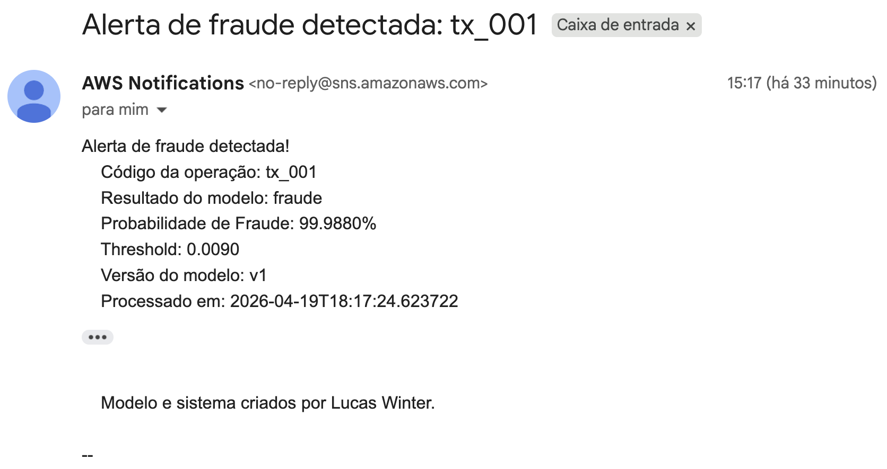
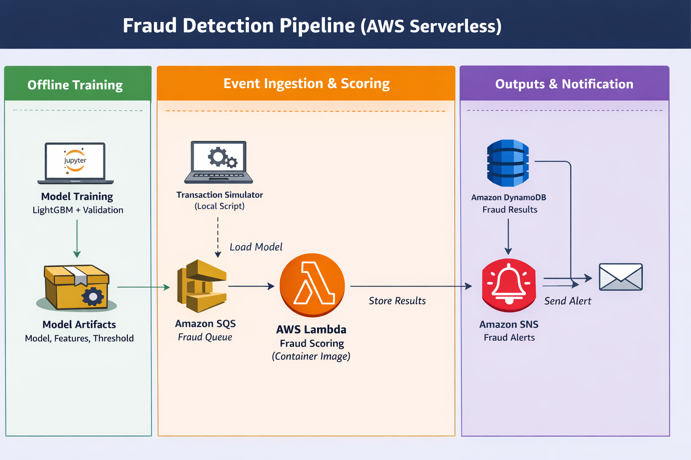

# Credit Fraud Detection with LightGBM

Production-style fraud detection pipeline built with LightGBM and AWS serverless services, covering model training, real-time scoring, event-driven processing, persistence, and alerting.

This project demonstrates an end-to-end machine learning workflow designed for practical backend and MLOps scenarios: local API inference, asynchronous cloud processing with SQS and Lambda, result storage in DynamoDB, and e-mail alerts through SNS.



## Descrição

Este projeto implementa um pipeline completo de detecção de fraude em transações financeiras usando LightGBM, com foco em inferência operacional e arquitetura serverless na AWS.

### Principais entregas

- treinamento e avaliação do modelo a partir da base `creditcard.csv`
- persistência dos artefatos de inferência
- API local com FastAPI para testes e desenvolvimento
- processamento assíncrono com SQS e Lambda
- persistência dos resultados no DynamoDB
- alerta por e-mail via SNS quando a predição for `fraude`

## Architecture


## Arquitetura

Os principais componentes são:

- `notebooks/caderno.ipynb`: exploração da base, treinamento do modelo e análise das métricas
- `artifacts/`: arquivos persistidos do modelo, das colunas e do threshold
- `src/predict.py`: lógica de inferência reaproveitada pela API local e pela Lambda
- `main.py`: API FastAPI para uso local
- `src/lambda_handler.py`: handler da AWS Lambda para consumo de mensagens do SQS
- `template.yaml`: infraestrutura definida com AWS SAM
- `Dockerfile`: imagem da Lambda, incluindo a dependência nativa necessária para o LightGBM

## Pipeline do processo

### 1. Treinamento e geração de artefatos

O processo começa no notebook [notebooks/caderno.ipynb](./notebooks/caderno.ipynb), onde a base `creditcard.csv` é analisada e o modelo LightGBM é treinado.

Durante essa etapa, o projeto:

- separa treino, validação e teste
- treina o modelo para classificação binária
- calcula métricas como AUC, precision-recall e classificação final
- define um `threshold` operacional para transformar probabilidade em decisão de negócio

Ao final do treinamento, são gerados os artefatos usados na inferência:

- `artifacts/modelo_lbm.pkl`
- `artifacts/colunas_modelo.pkl`
- `artifacts/threshold.pkl`

### 2. Camada de inferência compartilhada

A inferência usa os artefatos persistidos para calcular:

- `prob_fraude`: probabilidade estimada de fraude
- `resultado`: `fraude` ou `nao_fraude`, com base no threshold salvo

A função principal de inferência está em `src/predict.py` e é compartilhada entre os dois pontos de entrada do projeto:

- a API FastAPI
- a função Lambda

### 3. API local com FastAPI

A API local está em `main.py`.

Ela expõe os endpoints:

- `GET /`
- `GET /health`
- `POST /predict`

No `POST /predict`, a API:

1. valida o payload com Pydantic
2. chama a função `prever_fraude`
3. retorna probabilidade, classe prevista e threshold utilizado

### 4. Processamento assíncrono na AWS

Em produção, o processamento acontece de forma assíncrona:

1. uma mensagem é enviada para a fila SQS
2. a Lambda é acionada automaticamente
3. o payload da mensagem é validado
4. o modelo calcula a probabilidade de fraude
5. o resultado é salvo no DynamoDB
6. se a predição for `fraude`, a Lambda publica uma mensagem no SNS
7. o SNS envia um alerta por e-mail para a inscrição confirmada

## Infraestrutura AWS

A infraestrutura é definida em `template.yaml` com AWS SAM.

Os recursos principais são:

- uma fila SQS para entrada das transações
- uma tabela DynamoDB para armazenar os resultados
- um tópico SNS para alertas
- uma função Lambda empacotada como container image

O uso de container image foi adotado porque o LightGBM depende de biblioteca nativa do sistema operacional. O `Dockerfile` instala `libgomp`, necessária para o carregamento correto do modelo em ambiente Lambda.

### Dados persistidos

Os resultados são gravados no DynamoDB com campos como:

- `transaction_id`
- `features`
- `fraud_score`
- `prediction`
- `threshold`
- `model_version`
- `processed_at`

## Estrutura do projeto

```text
.
├── artifacts/
│   ├── colunas_modelo.pkl
│   ├── modelo_lbm.pkl
│   └── threshold.pkl
├── data/
│   └── creditcard.csv
├── events/
│   ├── event.json
│   └── sqs_event.json
├── images/
│   └── architecture.png
├── notebooks/
│   └── caderno.ipynb
├── src/
│   ├── __init__.py
│   ├── lambda_handler.py
│   ├── load_artifacts.py
│   ├── predict.py
│   └── schemas.py
├── Dockerfile
├── main.py
├── requirements.txt
├── run_local.py
├── template.yaml
└── test_lambda.py
```

## Como executar localmente

### 1. Criar e ativar ambiente virtual

```bash
python3 -m venv .venv
source .venv/bin/activate
pip install -r requirements.txt
```

### 2. Rodar um teste simples de inferência

```bash
python run_local.py
```

### 3. Subir a API local

```bash
uvicorn main:app --reload
```

Depois disso, a API pode ser acessada em:

- `http://127.0.0.1:8000/docs`

## Exemplo de payload da API

```json
{
  "V1": -1.271244,
  "V2": 2.462675,
  "V3": -2.851395,
  "V4": 2.324480,
  "V5": -1.372245,
  "V6": -0.948196,
  "V7": -3.065234,
  "V8": 1.166927,
  "V9": -2.268771,
  "V10": -4.881143,
  "V11": 2.255147,
  "V12": -4.686387,
  "V13": 0.652375,
  "V14": -6.174288,
  "V15": 0.594380,
  "V16": -4.849692,
  "V17": -6.536521,
  "V18": -3.119094,
  "V19": 1.715494,
  "V20": 0.560478,
  "V21": 0.652941,
  "V22": 0.081931,
  "V23": -0.221348,
  "V24": -0.523582,
  "V25": 0.224228,
  "V26": 0.756335,
  "V27": 0.632800,
  "V28": 0.250187,
  "Amount": 0.01
}
```

## Como testar a Lambda localmente

```bash
sam build
sam local invoke FraudScoringFunction -e events/sqs_event.json
```

## Como fazer deploy na AWS

```bash
sam deploy --guided
```

Para configurar o alerta por e-mail via SNS:

```bash
sam deploy --parameter-overrides AlertEmail=seu-email@exemplo.com
```

Depois do deploy, é necessário confirmar a inscrição recebida por e-mail do SNS para que os alertas sejam entregues.

## Como validar o fluxo em produção

Após o deploy, o fluxo pode ser testado assim:

1. enviar uma mensagem JSON para a fila SQS
2. confirmar a execução da Lambda no CloudWatch
3. verificar o item salvo no DynamoDB
4. verificar se o e-mail de alerta chegou quando `prediction == "fraude"`

O corpo da mensagem enviada ao SQS deve ter este formato:

```json
{
  "transaction_id": "tx_001",
  "features": {
    "V1": -1.271244,
    "V2": 2.462675,
    "V3": -2.851395,
    "V4": 2.324480,
    "V5": -1.372245,
    "V6": -0.948196,
    "V7": -3.065234,
    "V8": 1.166927,
    "V9": -2.268771,
    "V10": -4.881143,
    "V11": 2.255147,
    "V12": -4.686387,
    "V13": 0.652375,
    "V14": -6.174288,
    "V15": 0.594380,
    "V16": -4.849692,
    "V17": -6.536521,
    "V18": -3.119094,
    "V19": 1.715494,
    "V20": 0.560478,
    "V21": 0.652941,
    "V22": 0.081931,
    "V23": -0.221348,
    "V24": -0.523582,
    "V25": 0.224228,
    "V26": 0.756335,
    "V27": 0.632800,
    "V28": 0.250187,
    "Amount": 0.01
  }
}
```

## Tecnologias utilizadas

- Python
- Pandas
- Scikit-learn
- LightGBM
- FastAPI
- AWS Lambda
- AWS SQS
- AWS DynamoDB
- AWS SNS
- AWS SAM
- Docker

## Observações importantes

- o modelo utiliza artifacts persistidos em disco para inferência
- a Lambda usa container image por causa da dependência nativa do LightGBM
- o DynamoDB recebe números como `Decimal` para compatibilidade com o `boto3`
- o retorno da Lambda é convertido para tipos serializáveis em JSON

## Próximos passos

- adicionar testes automatizados com `pytest`
- adicionar observabilidade com CloudWatch Logs estruturados
- parametrizar nomes de recursos AWS por ambiente
- adicionar DLQ para a fila SQS
- versionar formalmente o modelo e os metadados de treino
